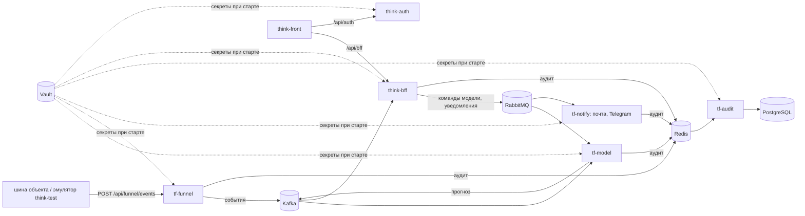

# think-auth

Сервис входа Think-Faster. Проверяет логин и пароль, выпускает токен доступа (JWT, подпись RS256) и
отдаёт публичный ключ, по которому токен проверяют остальные сервисы:
[think-bff](https://github.com/Think-Faster/think-bff), модель, приём данных, уведомления и аудит из
[Think-Faster](https://github.com/Think-Faster/Think-Faster). Учётные записи людей и техучётки
сервисов заводятся только здесь. Вход снаружи — через nginx (`/api/auth`).

Стек: .NET 8, ASP.NET Core, EF Core + PostgreSQL (своя схема `auth`). Закрытый ключ подписи и пароль
базы — из Vault при старте контейнера. Как войти эксперту —
[01-auth.md](https://github.com/Think-Faster/think-infra/blob/dev/docs/project/01-auth.md).

## Что где лежит

| Папка | Что внутри |
|---|---|
| [AuthService](AuthService) | решение .NET, [Dockerfile](AuthService/Dockerfile) |
| [AuthService/WebAPI](AuthService/WebAPI) | точка входа; [Controllers](AuthService/WebAPI/Controllers): вход и токены (`AuthController`), публичный ключ (`PublicKeyController`), учётные записи (`UserController`), здоровье |
| [AuthService/AuthContext.Models](AuthService/AuthContext.Models) | сущности: пользователь, учётные данные, токены |
| [AuthService/AuthService.Context](AuthService/AuthService.Context) | EF Core: контекст и миграции |
| [AuthService/AuthService.Cryptography](AuthService/AuthService.Cryptography) | хеширование паролей, подпись и проверка токенов |
| [migration](migration) | образ, который накатывает миграции под владельцем схемы |
| [deploy](deploy) | docker-compose и пример настроек без секретов |
| [vault-entrypoint.sh](vault-entrypoint.sh) | вход в Vault по AppRole и запуск сервиса с секретами в окружении |
| [.github/workflows](.github/workflows) | выкатка: пуш в `prod` выкатывает на [thinkfaster.ru](https://thinkfaster.ru) |

## Проект целиком

Think-Faster — сервис прогнозирования инцидентов в инженерных коллекторах (ЛЦТ-2026). Раз в час он
оценивает 78 объектов по журналу событий системы мониторинга и за сутки предупреждает о шести типах
происшествий: пожар, загазованность, подтопление, отказ оборудования, отказ датчика, проникновение.
К тревоге прилагаются основания и рекомендация: что сделать, в какой срок, кого послать. Решение
принимает диспетчер, сервис ничем на объекте не управляет.

| Что | Где |
|---|---|
| Прототип | [thinkfaster.ru](https://thinkfaster.ru) |
| Документация для экспертов: вход, архитектура, решения, методы, соответствие ТЗ, развёртывание, обзор | [think-infra/docs/project](https://github.com/Think-Faster/think-infra/tree/dev/docs/project) |
| Описание системы по сервисам | [think-infra/docs/system](https://github.com/Think-Faster/think-infra/tree/dev/docs/system) |
| Сопроводительная документация по ГОСТ 34.602, модель и исследование | [Think-Faster/docs/документация.md](https://github.com/Think-Faster/Think-Faster/blob/main/docs/документация.md) |

| Репозиторий | Что это | Стек |
|---|---|---|
| [Think-Faster](https://github.com/Think-Faster/Think-Faster) | модель прогноза, приём данных, уведомления, аудит; исследование, датасет, документация | Python, FastAPI, CatBoost, XGBoost, PyTorch; Go |
| [think-front](https://github.com/Think-Faster/think-front) | веб-интерфейс: диспетчер, главный диспетчер, инженер, администратор | React 19, TypeScript, Zustand |
| [think-bff](https://github.com/Think-Faster/think-bff) | API для интерфейса: права, группы, объекты, заявки, прогнозы, настройки модели | .NET 8, ASP.NET Core, EF Core, PostgreSQL |
| [think-auth](https://github.com/Think-Faster/think-auth) | вход и выпуск токенов RS256 | .NET 8, EF Core, PostgreSQL |
| [think-infra](https://github.com/Think-Faster/think-infra) | стенд: Vault, PostgreSQL, Kafka, RabbitMQ, Redis, nginx, почта, Telegram; выкатка | Docker Compose, Bash, GitHub Actions |
| [think-test](https://github.com/Think-Faster/think-test) | эмулятор шины объекта и проверка доступности стенда | Python, Django |

Код, который работает на [thinkfaster.ru](https://thinkfaster.ru): у think-front, think-bff и
think-auth — ветка `prod`; у think-infra — `prod`, документация — `dev`; у Think-Faster и think-test —
`main`.
